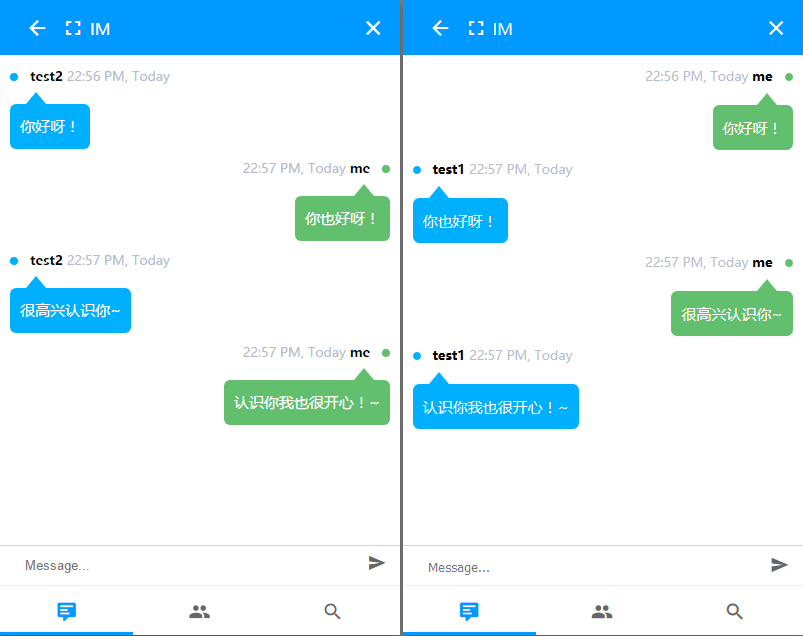

# Heliactin

A simple IM build with Node.js and Socket.io.

## Screenshot

## Installation for Development

### 1. For web

    cd imweb
    npm install

### 2. For desktop

    cd imdesktop
    npm install

### 3. Run server

    npm start

or

    node app.js

### 4. Visit from web

    http://localhost:3000

### 5. Visit from desktop

    electron .

## License

The MIT License.